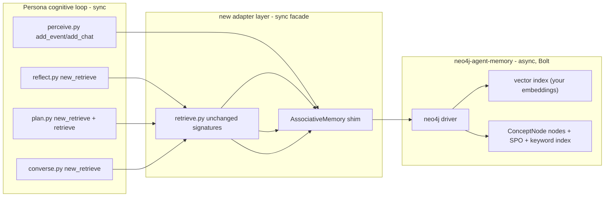

# Replace AssociativeMemory with neo4j-agent-memory (Bolt, canonical store)

## Decision context (from clarifying questions)
- Backend: **self-hosted Neo4j via Bolt** (you run Neo4j 5.20+).
- Ownership: **Neo4j becomes the canonical store** for long-term associative memory; JSON files are retired once migration completes.
- Scope today: **agent memory retrieval speed only**. Other long-session robustness issues are out of scope.

## Key finding that shapes the plan — read before approving
`neo4j-agent-memory` v0.5.0 models **`Conversation/Message/Entity/Preference/Fact/ReasoningTrace`** and ranks with its own `get_context()` logic. Your system models **`ConceptNode` (`event`/`thought`/`chat`)** with SPO triples, `poignancy`, `recency_decay`, and the Park et al. **recency + importance + relevance** scoring in `new_retrieve`. These do not map 1:1.

Because you said **"speed, not functionality,"** this plan **keeps your `ConceptNode` shape and your `new_retrieve` scoring algorithm intact** and uses Neo4j only as the storage + vector-index backend (fast ANN + graph lookup) behind an adapter. We deliberately do **not** adopt the package's `get_context()` ranking, because that *would* change retrieval behavior. If you later want the package's entity-graph semantics too, that's a separate, functionality-affecting follow-up.

Two other hard constraints from the research:
- The package is **async-only**; your `Persona` cognitive loop is **sync**. The adapter must bridge with `asyncio` (a single dedicated event loop per `MemoryClient`, not `asyncio.run` per call).
- Vector search needs **embeddings**. Your repo already has two embedders via `get_active().get_embedding()` (`BAAI/bge-small-en-v1.5`, 384-dim, or `text-embedding-ada-002`, 1536-dim). The package's `[sentence-transformers]` extra pulls a second copy of torch/transformers — we avoid it and feed your existing embeddings into Neo4j to prevent a second heavy toolchain and a dimension mismatch with already-stored vectors.



## What changes, by file

### 1. requirements.txt — add the dependency (the literal ask)
Append to [requirements.txt](../requirements.txt):
```text
neo4j-agent-memory==0.5.0
```
Core pulls in `neo4j>=5.20.0`, `pydantic>=2.0.0`, `pydantic-settings>=2.0.0`. No `[openai]`/`[sentence-transformers]` extra — we feed our own embeddings (avoids a second torch stack and dim mismatch with `rebuild_embeddings.py` history). Verify `pydantic>=2` does not conflict with Django/frontend deps (none expected; backend is plain Python).

### 2. Config — add Neo4j connection (Bolt)
Extend [reverie/backend_server/reverie_config.py](../reverie/backend_server/reverie_config.py) following the existing `load_dotenv`/`os.environ.get` pattern (placeholder values per repo rules — real values live in gitignored `.env`):
```python
neo4j_uri = os.environ.get("NEO4J_URI", "bolt://localhost:7687")
neo4j_username = os.environ.get("NEO4J_USERNAME", "neo4j")
neo4j_password = os.environ.get("NEO4J_PASSWORD", "")
neo4j_database = os.environ.get("NEO4J_DATABASE", "neo4j")
```
Add a **`.env.example`** (repo currently lacks one) documenting `NEO4J_URI/USERNAME/PASSWORD/DATABASE` plus existing `OPENAI_API_KEY`/`REVERIE_HARNESS`. Do **not** touch the real `.env` (repo rule: never commit it).

### 3. New adapter module (the core of the work)
New file `reverie/backend_server/persona/memory_structures/neo4j_memory.py` containing:
- `Neo4jAssociativeMemory` — implements the **same public surface** `AssociativeMemory` exposes today (`add_event`, `add_thought`, `add_chat`, `retrieve_relevant_events`, `retrieve_relevant_thoughts`, `retrieve_relevant_chat`, `get_summarized_latest_events`, `get_last_chat`, `get_str_seq_*`, `id_to_node`, `seq_event`, `seq_thought`, `seq_chat`) so `retrieve.py` and `run_gpt_prompt.py` call sites compile unchanged.
- A **`ConceptNode`** stored as a Neo4j node labeled `:ConceptNode` with properties: `node_id, type, depth, created, expiration, subject, predicate, object, description, embedding_key, poignancy, keywords, last_accessed`, plus `embedding` (vector) on the node. Relationships: `(:ConceptNode)-[:EVIDENCED_BY]->(:ConceptNode)` for `filling`, and keyword index nodes `(:Keyword {text})-[:TAGS]->(:ConceptNode)` to keep the O(1) keyword lookup path (`retrieve_relevant_*`) as graph traversals instead of Python dict unions.
- **Async bridge:** one persistent `asyncio` loop + `MemoryClient` (or raw `neo4j.AsyncGraphDatabase` driver) per persona, created lazily in `Persona.__init__`. Sync methods on the shim submit coros to that loop and block on the result. No `asyncio.run` per call (would re-init the driver every retrieval).
- **Embeddings:** call the existing `get_embedding()` from [reverie/backend_server/persona/prompt_template/gpt_structure.py](../reverie/backend_server/persona/prompt_template/gpt_structure.py) at write time and store the vector on the node — reuses your current embedder and respects the `REVERIE_HARNESS` embedder selection; avoids the package's own embedding providers.

### 4. Retrieval — push the O(n) scan into the database
[reverie/backend_server/persona/cognitive_modules/retrieve.py](../reverie/backend_server/persona/cognitive_modules/retrieve.py) keeps its signatures. `new_retrieve`'s **scoring formula stays identical** (recency + importance + relevance, weights from `scratch`), but the candidate set + relevance scores come from the database instead of a Python loop over `seq_event + seq_thought`:
- **relevance:** Neo4j vector ANN `db.index.vector.queryNodes` on the focal-point embedding → top-K candidates + cosine scores (replaces the linear `extract_relevance` scan over all non-idle nodes).
- **recency/importance:** fetched as node properties for the ANN candidate set; combined in Python exactly as today (`gw = [0.5, 3, 2]` + persona weights) → `top_highest_x_values(n_count)`.
- **keyword path** (`retrieve` / `retrieve_relevant_*`): graph traversal `(:Keyword)-[:TAGS]->(:ConceptNode)` replaces the `kw_to_*` dict unions in [associative_memory.py:305](../reverie/backend_server/persona/memory_structures/associative_memory.py) — still O(1)-ish, no Python-side union.
- `last_accessed` updated via a single batched Cypher write per retrieval.

### 5. Persona bootstrap / persistence
[reverie/backend_server/persona/persona.py](../reverie/backend_server/persona/persona.py) currently loads JSON in `__init__` and saves on `Persona.save`. For canonical Neo4j:
- `__init__`: open the Neo4j-backed `Neo4jAssociativeMemory` scoped by `(sim_code, persona_name)` instead of `json.load`-ing `nodes.json`/`embeddings.json`/`kw_strength.json`.
- `save`: becomes a no-op (or only saves `scratch.json` + `spatial_memory.json`, which stay file-based — see scope note).
- **One-time migration loader:** a script `reverie/backend_server/migrate_memory_to_neo4j.py` that reads existing `bootstrap_memory/associative_memory/{nodes,embeddings,kw_strength}.json` for a persona and bulk-loads `ConceptNode`s into Neo4j (reuses `rebuild_embeddings.py` patterns). Run per existing sim folder before cutover.

### 6. Out of scope (explicitly left alone)
- `scratch.json` and `spatial_memory.json` stay JSON/file-backed (they're not the memory stream and not the scaling bottleneck).
- Frontend `replay_persona_state` in [environment/frontend_server/translator/views.py](../environment/frontend_server/translator/views.py) reads JSON directly — for now, keep writing a JSON **export** snapshot on `save`/`fin` so the UI doesn't break. Full frontend rewire is a later task.
- `rebuild_embeddings.py` — stays usable for the migration loader; revisit after cutover.

## Phasing (so the speed win lands first, risk second)
1. **Infra + dep:** add `neo4j-agent-memory==0.5.0` to requirements.txt, add Neo4j config + `.env.example`, run a local Neo4j 5.20+ (Docker), smoke-test `MemoryClient` connect. *(this is the only step you literally asked me to do today)*
2. **Adapter + migration loader:** implement `neo4j_memory.py` with the shim surface; write `migrate_memory_to_neo4j.py`; load one existing persona's memory; verify `ConceptNode` counts match.
3. **Dual-read parity:** run `Neo4jAssociativeMemory` and the old `AssociativeMemory` side by side for one persona; assert `new_retrieve` / `retrieve_relevant_*` return the same node sets and same ranking on a recorded sim step (use the existing JSONL log in [reverie/backend_server/harnesses/memory_retrieval_log.py](../reverie/backend_server/harnesses/memory_retrieval_log.py) as oracle).
4. **Cutover (canonical):** point `Persona.__init__` at the Neo4j shim; make `save` a no-op for associative memory; keep JSON export for the frontend only.
5. **Retire JSON:** after N steps of stable canonical operation, stop writing `nodes.json`/`embeddings.json`; remove the old `AssociativeMemory` indexes.

## Risks / things to watch
- **Behavior drift:** ANN top-K + rerank can return a slightly different candidate set than an exhaustive linear scan over all nodes. Phase 3's parity check against the retrieval log is the guardrail. If exact parity is required, we can set ANN `top_k` high enough that the final top-`n_count` matches (the scoring in Python is unchanged, so only the candidate pool differs).
- **Async-in-sync cost:** every retrieval now crosses an event-loop bridge. Measured per-call Neo4j vector search is ~5–50ms vs your current in-process cosine; the bridge adds negligible overhead but introduces a one-time driver/loop init per persona at startup.
- **Embedding dimension lock-in:** once vectors are in Neo4j, switching embedder (e.g. bge→ada) requires re-embedding all nodes — same problem `rebuild_embeddings.py` already solves; the migration loader should reuse it.
- **Package immaturity:** `neo4j-agent-memory` is beta, fast-moving (v0.0.1 → v0.5.0 in ~4 months), community-supported. Pinning `==0.5.0` protects us; the adapter isolates its API from your code so a version bump is a one-file change.
- **`pydantic>=2`** is pulled in — verify nothing in the backend path pins pydantic v1 (a quick grep at execution time).

## Concrete first action (if you approve "try it now")
Just step 1: add the line to requirements.txt, add the Neo4j env vars + `.env.example`, and run `pip install -r requirements.txt` + a connectivity smoke test against a local Docker Neo4j. No cognitive-loop code changes in that first step — purely plumbing so you can validate the infra before I touch `AssociativeMemory`.
